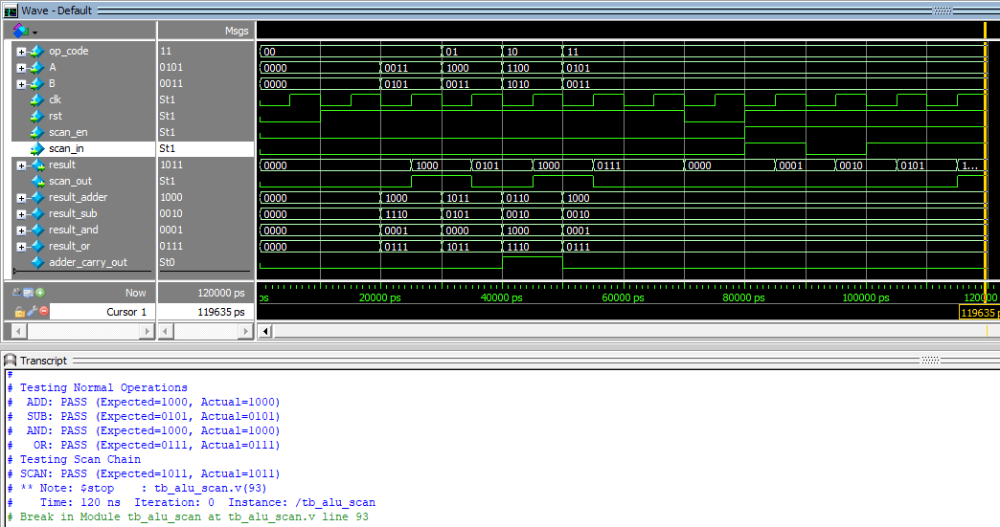

# 4-bit ALU with Scan Chain

This document specifies the design of a 4-bit Arithmetic Logic Unit (ALU) with basic operations and scan chain functionality. The ALU supports arithmetic and logical operations and allows testing via a scan chain to read/write internal states.

---

## Functional Description
The ALU performs the following operations based on the `op_code` input:

| `op_code` | Operation  |
|:---------:|:----------:|
| `00`      | Addition   |
| `01`      | Subtraction|
| `10`      | AND        |
| `11`      | OR         |

The ALU operates in two modes:
1. **Normal Mode**: Executes the operation specified by `op_code` on inputs `A` and `B`.
2. **Scan Mode**: When `scan_en` is active, the ALU acts as a shift register for scan chain testing, allowing its internal states to be read or written via `scan_in` and `scan_out`.

An asynchronous active-low `rst` is provided to initialize the ALU state.

---

## I/O Signals

| Signal        | Direction | Width | Description |
|---------------|:---------:|:-----:|-------------|
| `op_code`     | Input     | 2     | Operation code selecting the ALU operation. |
| `A`           | Input     | 4     | First operand for the ALU operation. |
| `B`           | Input     | 4     | Second operand for the ALU operation. |
| `result`      | Output    | 4     | Result of the ALU operation in normal mode. |
| `clk`         | Input     | 1     | Clock signal. Updates ALU state on the rising edge. |
| `rst`         | Input     | 1     | Asynchronous active-low reset. Resets the ALU to an initial state. |
| `scan_en`     | Input     | 1     | Enables scan mode when set to `1`. |
| `scan_in`     | Input     | 1     | Scan input for scan mode operation. |
| `scan_out`    | Output    | 1     | Scan output. Passes the MSB of the ALU internal state in scan mode. |

---

## Functional Behavior

### Reset Behavior
- When `rst` is asserted (`rst = 0`):
  - The ALU internal state is reset to `0`.
- When `rst` is deasserted (`rst = 1`):
  - The ALU operates normally in either normal mode or scan mode.

### Normal Mode
- Condition: `scan_en = 0`
- Behavior:
  - The operation specified by `op_code` is performed on `A` and `B`.
  - The result is updated on every rising edge of `clk` and made available on `result`.

### Scan Mode
- Condition: `scan_en = 1`
- Behavior:
  - On each rising edge of `clk`, the ALU internal state shifts left by one bit.
  - The new data is loaded into the LSB from `scan_in`.
  - The MSB is passed to `scan_out`.

---
## RTL Design Code (in Verilog)
```verilog
// 40bit ALU withj Scan Chain (DFT)
module alu_scan(
	input wire [1:0] op_code, 	// Operation code
	input wire [3:0] A,			// First operand
	input wire [3:0] B, 		// Second operand
	input wire clk,				// Clock signal
	input wire rst,				// Active-low reset
	input wire scan_en,			// Scan mode enable 
	input wire scan_in, 		// Scan input 
	output reg [3:0] result, 	// ALU result output
	output wire scan_out		// Scan output 
);
	// wire for connecting
	wire [3:0] result_adder;
	wire [3:0] result_sub;
	wire [3:0] result_and;
	wire [3:0] result_or;
	wire adder_carry_out;
	
	// Operation 
	full_adder_4bit fa4bit(.A(A),.B(B),.c_in(1'b0),.c_out(adder_carry_out),.S(result_adder));
	sub_4bit sub4bit(.A(A),.B(B),.S(result_sub));
	and_4bit a4bit(.A(A),.B(B),.S(result_and));
	or_4bit o4bit(.A(A),.B(B),.S(result_or));	
	
	
	always @(posedge clk or negedge rst) begin
		if (!rst) begin
			result <= 4'b0; 	// Reset ALU result 
		end else if (scan_en) begin 
			// Scan mode: Shift left and input scan_in 
			result <= {result[2:0], scan_in};
		end else begin 
			// Normal mode: Perform ALU operations
			case (op_code) 
				2'b00: result <= result_adder;	// Addition
				2'b01: result <= result_sub;	// Subtraction
				2'b10: result <= result_and;	// AND
				2'b11: result <= result_or;		// OR
				default: result <= 4'b0; 		// Default case 
			endcase 
		end
	end 
	
	assign scan_out = result[3]; // MSB as scan output 
endmodule 


// 1-bit Full Adder 
module full_adder(
	input wire A,
	input wire B,
	input c_in,
	output wire c_out,
	output wire S
);
	assign S = A^B^c_in;
	assign c_out = (A&B)|(A&c_in)|(B&c_in);
 endmodule  
 
 // 4-bit Full Adder 
module full_adder_4bit(
	input wire [3:0] A,
	input wire [3:0] B,
	input wire c_in, 
	output wire c_out, 
	output wire [3:0] S
);
	wire [3:0] carry;
	full_adder fa0(.A(A[0]),.B(B[0]),.c_in(0),.c_out(carry[0]),.S(S[0]));
	full_adder fa1(.A(A[1]),.B(B[1]),.c_in(carry[0]),.c_out(carry[1]),.S(S[1]));
	full_adder fa2(.A(A[2]),.B(B[2]),.c_in(carry[1]),.c_out(carry[2]),.S(S[2]));
	full_adder fa3(.A(A[3]),.B(B[3]),.c_in(carry[2]),.c_out(carry[3]),.S(S[3]));
	
	assign c_out = carry[3];
endmodule 

// 4-bit Subtractor module 
module sub_4bit(
	input wire [3:0] A,
	input wire [3:0] B,
	output wire [3:0] S
);
	wire [3:0] minusB;
	wire c_out;
	co2_4bit mB(.A(B),.S(minusB));
	full_adder_4bit fa4_sub(.A(A),.B(minusB),.c_in(1'b0),.c_out(c_cout),.S(S));
endmodule 

// Complementary of 2 for 4-bit
module co2_4bit(
	input wire [3:0] A,
	output wire [3:0] S
);
	wire [3:0] qA;
	wire c_out;
	not_4bit n4(.A(A),.qA(qA));
	full_adder_4bit fa4_co2(.A(qA),.B(4'b0001),.c_in(1'b0),.c_out(c_out),.S(S));
endmodule 

// Not 4 bit module 
module not_4bit(
	input wire [3:0] A,
	output wire [3:0] qA
);
	assign qA[0] = ~A[0];
	assign qA[1] = ~A[1];
	assign qA[2] = ~A[2];
	assign qA[3] = ~A[3];
endmodule

// 4-bit AND module 
module and_4bit(
	input wire [3:0] A,
	input wire [3:0] B,
	output wire [3:0] S
);
	assign S[0] = A[0]&B[0];
	assign S[1] = A[1]&B[1];
	assign S[2] = A[2]&B[2];
	assign S[3] = A[3]&B[3];
endmodule 

// 4-bit OR module 
module or_4bit(
	input wire [3:0] A,
	input wire [3:0] B,
	output wire [3:0] S
);
	assign S[0] = A[0]|B[0];
	assign S[1] = A[1]|B[1];
	assign S[2] = A[2]|B[2];
	assign S[3] = A[3]|B[3];
endmodule 	
```
## Testbench
```
`timescale 1ns/1ps
module tb_alu_scan();
	reg [1:0] op_code;
	reg [3:0] A;
	reg [3:0] B;
	reg clk;
	reg rst;
	reg scan_en;
	reg scan_in;
	wire [3:0] result;
	wire scan_out;
	
	// Instantiate the DUT 
	alu_scan dut(.op_code(op_code),.A(A),.B(B),.clk(clk),.rst(rst),
				.scan_en(scan_en),.scan_in(scan_in),.result(result),.scan_out(scan_out));
	// Clock generation
initial clk = 0;
always #5 clk = ~clk;

	// Task to check result and display pass/fail
	task check_result;
		input [3:0] expected_result;
		input [3:0] actual_result;
		input [31:0] operation; 
		begin 
			if(expected_result == actual_result) begin 
				$display("%s: PASS (Expected=%b, Actual=%b)", operation, expected_result, actual_result);
			end else begin
				$display("%s: FAIL (Expected=%b, Actual=%b)", operation, expected_result, actual_result);
			end
		end 
	endtask 
	
	// Test Procedure
initial begin 
	clk = 0;
	// Initialize signals 
	rst = 0;
	scan_en = 0;
	scan_in = 0;
	A = 4'b0000;
	B = 4'b0000;
	op_code = 2'b00;
	
	// Apply reset 
	#10 rst = 1; // Release Reset after 10ns 
	#10;
	
	// Test Normal operations 
	$display("Testing Normal Operations");
	
	// Test addition
	op_code = 2'b00; // Addition
	A = 4'b0011; // 3
	B = 4'b0101; // 5
	#10 check_result(4'b1000, result, "ADD"); // Sum = 8
		
	// Test Subtraction 
	op_code = 2'b01; // Subtraction 
	A = 4'b1000; // 8
	B = 4'b0011; // 3
	#10 check_result(4'b0101, result, "SUB"); // sub = 5
	
	// Test AND 
	op_code = 2'b10; // AND 
	A = 4'b1100;
	B = 4'b1010;
	#10 check_result(4'b1000, result, "AND");
	
	// Test OR 
	op_code = 2'b11; // OR 
	A = 4'b0101; 
	B = 4'b0011;
	#10 check_result(4'b0111, result, "OR");
	
	
	// Test sacn chain functionality 
	$display("Testing Scan Chain");
	#10 rst = 0;
	#10 rst = 1;
	scan_en = 1;
	
	// Shift in a pattern through scan chain 
	scan_in = 1; #10; 
	scan_in = 0; #10;
    scan_in = 1; #10;
    scan_in = 1; #10;
	
	// Observe scan_out 
	check_result(4'b1011, result, "SCAN");
	
	// Finish simulation 
	$stop;
end 
endmodule
```
## Simulation on ModelSim 

