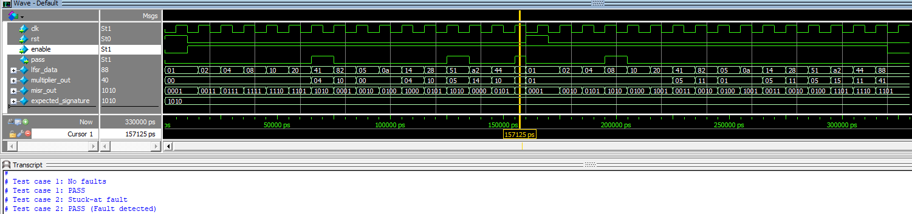

# Built-In Self-Test (BIST) System Specification


This project implements a complete Built-In Self-Test (BIST) system to validate the functionality of a 4-bit Multiplier. The system is designed to automatically detect hardware faults, such as stuck-at-0 and stuck-at-1 faults, using key components like Linear Feedback Shift Register (LFSR), Multiple Input Signature Register (MISR), and a Comparator.

---

## System Components
The BIST system consists of the following components:

1. Linear Feedback Shift Register (LFSR):
   - Generates pseudo-random test patterns to stimulate the circuit under test (CUT).
   - Configured as an 8-bit LFSR with a polynomial for maximum-length sequence generation.

2. 4-bit Multiplier (CUT):
   - The circuit under test performs 4-bit multiplication of two inputs.
   - Stuck-at faults are injected to simulate hardware failures for testing purposes.

3. Multiple Input Signature Register (MISR):
   - Compresses the output responses of the CUT into a compact signature.
   - Operates synchronously with the system clock.

4. Comparator:
   - Compares the computed signature (from MISR) with the expected signature.
   - Outputs a `pass` signal indicating whether the CUT passed or failed the test.

### RTL code for these components
```Verilog
// 8-bit LFSR
module LFSR_8bit(
	input wire clk,
	input wire rst,
	input wire enable,
	output reg [7:0] lfsr
);
	always @(posedge clk or posedge rst) begin 
		if(rst)
			lfsr <= 8'b0000_0001;
		else if(enable)
			lfsr <= {lfsr[6:0], lfsr[7]^lfsr[5]}; // XOR Taps at [8, 6]
	end
endmodule 


// 4-bit Multiplier - Circuit Under Test (CUT)
module multiplier_4bit(
	input wire [3:0] a,
	input wire [3:0] b,
	output wire [7:0] product
);
	assign product = a * b; 
endmodule


// 4-bit MISR 
module MISR_4bit(
	input wire clk,
	input wire rst,
	input wire enable,
	input wire [3:0] data_in,
	output reg [3:0] misr_out
);
	always @(posedge clk or posedge rst) begin 
		if (rst) 
			misr_out <= 4'b0001; // Initial non-zero state
		else if(enable) 
			misr_out <= {misr_out[2:0], misr_out[3]^misr_out[0]} ^ data_in; // update misr 
	end
endmodule


// Comparator (4-bit)
module comparator(
	input wire [3:0] actual_signature,
	input wire [3:0] expected_signature,
	output wire pass
);
	assign pass = (actual_signature == expected_signature) ? 1'b1 : 1'b0;
endmodule	
```


---

## BIST Operation
The BIST system follows these steps to validate the CUT:

1. Initialization:
   - The system is reset, clearing all registers and preparing the LFSR to generate test patterns.

2. Test Pattern Generation:
   - The LFSR generates 8-bit pseudo-random patterns for the two inputs of the 4-bit Multiplier.
   - Test patterns are applied synchronously to the CUT.

3. Response Compression:
   - The outputs of the CUT are compressed into a 4-bit signature using the MISR.
   - The MISR combines the CUT's outputs with its current state using XOR operations.

4. Fault Detection:
   - The computed signature from the MISR is compared to a precomputed expected signature.
   - The circuit will be run 15 clock cycles, the signature will be `4'b1010`
   - If the signatures match, the CUT is fault-free (`pass = 1`).
   - If the signatures differ, a fault is detected (`pass = 0`).

5. Reporting:
   - The final result (`pass` signal) is reported at the end of the test sequence.

### RTL code for BIST System
```Verilog
module BIST_system(
	input wire clk, 
	input wire rst,
	input wire enable,
	output wire pass
);

	wire [7:0] lfsr_data;
	wire [7:0] multiplier_out;
	wire [3:0] misr_out;
	wire [3:0] expected_signature = 4'b1010; // The signature for 15 clock cycles!
	
	LFSR_8bit lfsr_inst (.clk(clk),.rst(rst),.enable(enable),.lfsr(lfsr_data));
	multiplier_4bit mul_inst (.a(lfsr_data[3:0]),.b(lfsr_data[7:4]),.product(multiplier_out));
	MISR_4bit misr_inst (.clk(clk),.rst(rst),.enable(enable),.data_in(multiplier_out[7:4]^multiplier_out[3:0]),.misr_out(misr_out));
	comparator comp_inst (.actual_signature(misr_out),.expected_signature(expected_signature),.pass(pass));
	
endmodule
```


---

## Testbench
The testbench simulates the BIST system under the following conditions:

1. No Fault:
   - The CUT operates correctly with no injected faults.
   - The expected behavior is that the signatures match, and the system reports `Pass`.

2. Stuck-at Fault:
   - A stuck-at fault (e.g., `stuck-at-1` on one bit of the multiplier output) is injected into the CUT.
   - In this testbench, I injected stuck-at-1 fault on the LSB of multiplier output by this command `force dut.mul_inst.product[0] = 1'b1;` 
   - The expected behavior is that the signatures do not match, and the system reports `Fail`.

### Verilog code for Testbench
```Verilog
`timescale 1ns/1ps
module tb_BIST_system();
	reg clk;
	reg rst;
	reg enable;
	wire pass;
	
	localparam NUM_CYCLES = 15; // Number of test cycles
	
	// Connect to the module BIST
	BIST_system dut (.clk(clk),.rst(rst),.enable(enable),.pass(pass));
	
	// Clock generation
initial clk = 0;
always #5 clk = ~clk; // 10ns cycles 

	// Run the test 
initial begin 
	rst = 1;
	enable = 0;
	#10;
	rst = 0;
	
	// Check for no fault 
	$display("Test case 1: No faults");
	enable = 1;
	#(NUM_CYCLES * 10); // number of clock cycles 
	if(pass)	$display("Test case 1: PASS");
	else 		$display("Test case 1: FAIL");
	
	// Add stuck-at fault to Multiplier 
	inject_stuck_at_fault();
	
	// Reset BIST 
	rst = 1; 
	#10;
	rst = 0; 
	
	$display("Test case 2: Stuck-at fault");
	#(NUM_CYCLES*10); // number of clock cycles
	if(!pass) 	$display("Test case 2: PASS (Fault detected)");
	else 		$display("Test case 2: FAIL (Fault not detected)");
	
	enable = 0;
	#10; 
	$stop;
end 

	// Task: Inject Stuck-at fault 
	task inject_stuck_at_fault;
		begin 
			force dut.mul_inst.product[0] = 1'b1; // The first output bit of Multiplier be stuck-at-1;
		end
	endtask
endmodule 
```

---

## Simulation Results
- Test Case 1: No Faults
  - The BIST system reports `Pass` when no faults are present in the CUT.

- Test Case 2: Stuck-at Fault
  - The BIST system reports `Fail` when a stuck-at fault is injected into the CUT.

This simulation I ran on ModelSim



---