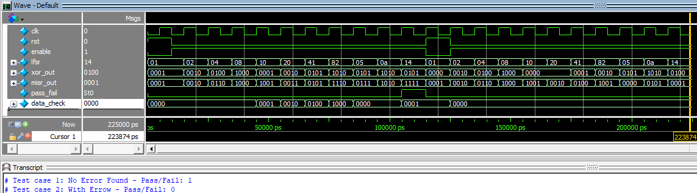

# Specification for LFSR-based Error Detection

## Overview
This project aims to detect faults (stuck-at-0 or stuck-at-1) in a 4-bit XOR gate by using an 8-bit Linear Feedback Shift Register (LFSR) for signature generation and a 4-bit MISR (Multiple Input Signature Register) to compress the output. The expected behavior is verified by comparing the actual output signature with a pre-defined expected signature.

## Components:
1. **LFSR 8-bit**: The LFSR generates random test patterns, which are fed into the XOR gate. It is responsible for generating a sequence of values that can be used to test the XOR gate.
   
2. **XOR Gate 4-bit**: A 4-bit XOR gate that compares the lower 4 bits of the LFSR output with a fixed 4-bit value. This module simulates the logic we wish to check for faults.

3. **MISR 4-bit**: The MISR module compresses the output of the XOR gate into a single signature. The signature is a 4-bit value calculated using the feedback of the previous bits.

4. **Comparator**: The comparator compares the generated signature from the MISR with the expected signature. If they match, the test passes; otherwise, it fails.

## Fault Detection Using Signature:
- **Fault-free case**: When there is no fault in the XOR gate, the MISR will generate the expected signature (`4'b1111`) after 10 clock cycles. 
  
- **Faulty case (stuck-at fault)**: A fault occurs when an input of the XOR gate is stuck at either 0 or 1. For example, if one of the XOR inputs is stuck at 0, the output of the XOR gate will differ from the expected value, and the MISR will generate a different signature than expected.

- **Pass/Fail**: The output signature from the MISR is compared with the expected signature. If they match, the result is a "Pass". If they don't match, the result is a "Fail".

## Error Detection Mechanism:
- The primary method for detecting errors is by comparing the MISR output to the expected signature. If the MISR output deviates from the expected signature, it indicates that an error (such as a stuck-at fault) has occurred.

---

## Verilog Code for the project
```Verilog
// LFSR 8-bit
module LFSR_8bit(
	input wire clk,
	input wire rst,
	input wire enable,
	output reg [7:0] lfsr
);
	always @(posedge clk or posedge rst) begin 
		if(rst)
			lfsr <= 8'b0000_0001;
		else if(enable)
			lfsr <= {lfsr[6:0], lfsr[7]^lfsr[5]}; // XOR Taps at [8, 6]
	end
endmodule


// XOR Gate 4-bit
module XOR_4bit(
	input wire [3:0] in1,
	input wire [3:0] in2,
	output wire [3:0] out
);
	assign out = in1 ^ in2;
endmodule


// MISR 4-bit
module MISR_4bit(
	input wire clk,
	input wire rst,
	input wire enable,
	input wire [3:0] data_in,
	output reg [3:0] misr_out
);
	always @(posedge clk or posedge rst) begin 
		if (rst) 
			misr_out <= 4'b0001; // Initial non-zero state
		else if(enable) 
			misr_out <= {misr_out[2:0], misr_out[3]^misr_out[0]} ^ data_in; // update misr 
	end
endmodule
			


// Comparator 
module comparator(
	input wire [3:0] actual_signature,
	input wire [3:0] expected_signature,
	output reg pass_fail
);
	assign pass_fail = (actual_signature == expected_signature) ? 1'b1 : 1'b0;
endmodule	
```

---

## Testbench Code
```Verilog
`timescale 1ns/1ps
module tb_LFSR_test();
	reg clk;
	reg rst;
	reg enable;
	wire [7:0] lfsr;
	wire [3:0] xor_out;
	wire [3:0] misr_out;
	wire pass_fail;
	
	reg [3:0] data_check;
	
	// Instantiate Modules
	LFSR_8bit lfsr_inst (.clk(clk),.rst(rst),.enable(enable),.lfsr(lfsr));
	XOR_4bit xor_inst (.in1(lfsr[3:0]),.in2(data_check),.out(xor_out));
	MISR_4bit misr_inst (.clk(clk),.rst(rst),.enable(enable),.data_in(xor_out),.misr_out(misr_out));
	comparator comp_inst (.actual_signature(misr_out),.expected_signature(4'b1111),.pass_fail(pass_fail));

	
	// Clock generation 
initial clk = 0;
always #5 clk = ~clk;

initial begin 
	// Initialize 
	rst = 1;
	enable = 0;
	data_check = 0;
	#10 rst = 0;
	
	// Test case 1: no error
	enable = 1;
	repeat (10) @(lfsr) data_check = lfsr[7:4];  // For 10 clock cycles
	$display("Test case 1: No Error Found - Pass/Fail: %b", pass_fail);
	
	// Test case 2: with error (stock-at zero) 
	#10;
	enable = 0;
	rst = 1;
	#10 rst = 0;
	// Add the error of stuck-at to XOR gate (e.g fix an input with 4'b0
	enable = 1;
	data_check = 4'b0000;
	#100;  // For 10 clock cycles
	$display("Test case 2: With Errow - Pass/Fail: %b", pass_fail);
	
	$stop;
end 
endmodule
```

## Simulation with ModelSim

