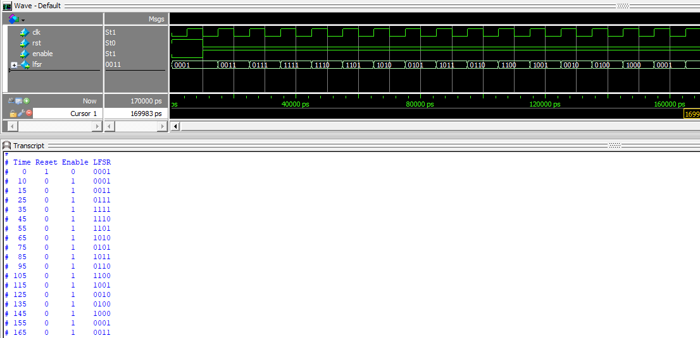

# **Specification: 4-bit Linear Feedback Shift Register (LFSR)**

The 4-bit Linear Feedback Shift Register (LFSR) is a simple hardware component used to generate pseudo-random sequences. It utilizes shift operations and feedback logic based on XOR operations to generate a sequence with a maximum length of \(2^n - 1\), where \(n\) is the number of bits in the LFSR. This LFSR has tap positions at bits [4, 1].

---

## **Features**
- **Input Signals**:
  - `clk`: Clock signal to synchronize the LFSR.
  - `rst`: Asynchronous reset to initialize the LFSR to a known non-zero state.
  - `enable`: Enables or disables the LFSR operation.
- **Output Signal**:
  - `lfsr [3:0]`: Current 4-bit state of the LFSR.

- **Feedback Logic**:
  - The feedback value is calculated as `lfsr[3] ^ lfsr[0]`.
  - The most significant bit (MSB) is shifted out, and the feedback value is shifted into the least significant bit (LSB).

---

## **Functional Description**
1. **Reset Behavior**:
   - When `rst` is asserted (logic high), the LFSR initializes to `4'b0001`.
   - The reset state must be a non-zero value to ensure proper operation.

2. **Enable Behavior**:
   - When `enable` is asserted, the LFSR performs a shift operation on the rising edge of the clock.
   - If `enable` is de-asserted, the LFSR maintains its current state.

3. **Shift Operation**:
   - On each clock cycle, if enabled, the LFSR shifts all bits to the right.
   - The new LSB is determined by the XOR of `lfsr[3]` (MSB) and `lfsr[0]`.

4. **Cycle Length**:
   - The LFSR generates a sequence with a maximum length of \(2^4 - 1 = 15\) states.
   - State `4'b0000` is invalid and never occurs in the sequence.

---
## RTL design (in Verilog)
```Verilog
// Module 4-bit LFSR (Linear Feedback Shift Register) with taps at [4, 1]
module lfsr_4bit(
	input wire clk,
	input wire rst,
	input wire enable,
	output reg [3:0] lfsr
);
	always @(posedge clk or posedge rst) begin 
		if(rst) begin 
			lfsr <= 4'b0001; // Initial non-zero state 
		end else begin
			lfsr <= {lfsr[2:0], lfsr[3]^lfsr[0]}; // Feedback using XOR
		end
	end
endmodule
```
## **Testbench**
A testbench is provided to verify the functionality of the LFSR.
```Verilog
`timescale 1ns/1ps

// Testbench for LFSR 4-bit
module tb_lfsr_4bit();
	reg clk; 
	reg rst;
	reg enable;
	wire [3:0] lfsr;
	
	// Initialize the LFSR module 
	lfsr_4bit uut(.clk(clk),.rst(rst),.enable(enable),.lfsr(lfsr));
	
	// Clock generation
initial clk = 0;
always #5 clk = ~clk; // 10ns clock Period

	// Test sequence
initial begin
	$display("Time Reset Enable LFSR");
	$monitor("%3d    %b     %b    %b", $time, rst, enable, lfsr);
	
	// Initialize signals
	rst = 1;
	enable = 0;
	
	#10;
	rst = 0;
	enable = 1;
	
	// Run LFSR for 16 clock cycles
	#160;
	
	// Finish simulation
	$stop;
end 
endmodule 
```
### Testbench Features
1. **Reset Initialization**:
   - Asserts `rst` to initialize the LFSR to the starting state.

2. **Sequence Generation**:
   - Enables the LFSR and generates the sequence for at least 16 clock cycles to verify the full sequence length.

3. **State Monitoring**:
   - Displays the state of the LFSR at each clock cycle for debugging and verification.

---

## **Usage**
1. **Instantiation**:
   Include the LFSR module in your design and connect the `clk`, `rst`, and `enable` signals as needed.

   ```verilog
   lfsr_4bit uut (
       .clk(clk),
       .rst(rst),
       .enable(enable),
       .lfsr(lfsr)
   );
   ```

2. **Signal Control**:
   - Drive `clk` with a clock signal.
   - Assert `rst` at the beginning to initialize the LFSR.
   - Toggle `enable` to control the operation of the LFSR.

---

## Simulation on ModelSim


---

## **Applications**
- Pseudo-random number generation.
- Data scrambling and encoding.
- Built-in Self-Test (BIST) mechanisms.

---

## **Limitations**
- The LFSR must not be initialized to `4'b0000` as it will lock in an invalid state.
- The sequence length is fixed at 15 states for a 4-bit LFSR.

---

## **Conclusion**
This 4-bit LFSR module is a compact and efficient way to generate pseudo-random sequences with minimal hardware. The design is verified through simulation and is ready for integration into larger systems.

