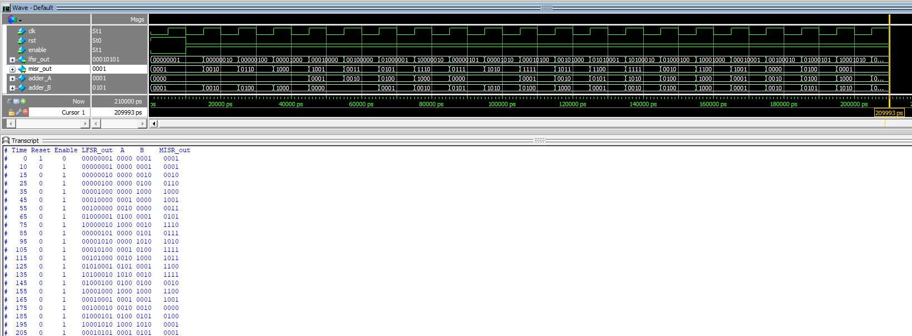

# **Specification: BIST System with LFSR and MISR**

This document specifies the design of a Built-In Self-Test (BIST) system integrating an 8-bit Linear Feedback Shift Register (LFSR) for generating test vectors, a 4-bit Adder for performing operations, and a 4-bit Multiple Input Signature Register (MISR) for compressing the outputs into a signature. The BIST system is designed to validate the functionality of the Adder and provide self-test capability.

---
## BIST Architecture

## System Components

### 8-bit LFSR
- **Purpose**: Generates pseudo-random test vectors for the Adder.
- **Input Ports**:
  - `clk`: Clock signal.
  - `rst`: Resets the LFSR to its initial state.
  - `enable`: Enables the operation of the LFSR.
- **Output Ports**:
  - `lfsr[7:0]`: Current value of the LFSR.
- **Feedback**: XOR operation with taps at positions [8, 6].

### 4-bit Adder
- **Purpose**: Performs addition on 4-bit input vectors.
- **Input Ports**:
  - `A[3:0]`: First 4-bit input vector from the LFSR.
  - `B[3:0]`: Second 4-bit input vector from the LFSR.
- **Output Ports**:
  - `S[3:0]`: Sum of the two input vectors.

### 4-bit MISR
- **Purpose**: Compresses the output from the Adder into a signature using a shift register with feedback.
- **Input Ports**:
  - `clk`: Clock signal.
  - `rst`: Resets the MISR to its initial state.
  - `enable`: Enables the operation of the MISR.
  - `adder_out[3:0]`: Output from the Adder.
- **Output Ports**:
  - `misr[3:0]`: Current value of the MISR (signature).
- **Feedback**: XOR operation with taps at positions [4, 1] then XOR operation with `adder_out[3:0]`:
```Verilog
misr <= {misr[2:0], misr[3]^misr[0]} ^ adder_out[3:0];
```

---

## Top-Level System
### Ports
- **Inputs**:
  - `clk`: Clock signal for synchronizing all modules.
  - `rst`: Resets the LFSR and MISR to initial states.
  - `enable`: Enables the operation of the BIST system.
- **Outputs**:
  - `lfsr_out[7:0]`: Current value of the LFSR.
  - `misr_out[3:0]`: Current signature from the MISR.

### Functionality
- The LFSR generates pseudo-random 8-bit values.
- The upper 4 bits (`lfsr[7:4]`) and lower 4 bits (`lfsr[3:0]`) of the LFSR are fed as inputs to the 4-bit Adder.
- The 4-bit sum from the Adder is fed into the MISR, which compresses the outputs into a 4-bit signature.

---
## RTL Design Code (in Verilog)
```Verilog
// Module 8-bit LFSR
module lfsr_8bit(
	input wire clk,
	input wire rst,
	input wire enable,
	output reg [7:0] lfsr
);
	always @(posedge clk or posedge rst) begin 
		if(rst) begin
			lfsr <= 8'b0000_0001; // Initial non-zero state
		end else if(enable) begin 
			// Feedback using XOR with taps at [8, 6]
			lfsr <= {lfsr[6:0], lfsr[7]^lfsr[5]}; 
		end 
	end
endmodule 

// Module 4-bit Adder 
module adder_4bit(
	input wire [3:0] A,
	input wire [3:0] B, 
	output wire [3:0] S
);
	assign S =  A + B; 
endmodule 

// Module 4-bit MISR
module misr_4bit(
	input wire clk, 
	input wire rst, 
	input wire enable,
	input wire [3:0] adder_out,
	output reg [3:0] misr 
);
	always @(posedge clk or posedge rst) begin 
		if(rst) begin 
			misr <= 4'b0001; // Initial non-zero state
		end else if (enable) begin 
			misr <= {misr[2:0], misr[3]^adder_out[3]} ^ adder_out[2:0];
		end
	end 
endmodule 

// Top-level Module: BIST System
module bist_system(
	input wire clk, 
	input wire rst, 
	input wire enable,
	output [7:0] lfsr_out,
	output [3:0] misr_out
);
	wire [3:0] adder_A;
	wire [3:0] adder_B;
	wire [3:0] adder_S;
	
	// Instantiate 8-bit LFSR 
	lfsr_8bit lfsr_inst(.clk(clk),.rst(rst),.enable(enable),.lfsr(lfsr_out));
	
	// Connect LFSR output to Adder inputs
	assign adder_A = lfsr_out[7:4];
	assign adder_B = lfsr_out[3:0];
	
	// Instantiate 4-bit Adder 
	adder_4bit adder_inst(.A(adder_A),.B(adder_B),.S(adder_S));
	
	// Instantiate 4-bit MISR
	misr_4bit misr_inst(.clk(clk),.rst(rst),.enable(enable),.adder_out(adder_S),.misr(misr_out));

endmodule 
```

## Testbench Specifications

### Objectives
- Validate the integration and functionality of the LFSR, Adder, and MISR.
- Simulate the generation of test vectors and the resulting signature.

### Test Sequence
1. **Reset Initialization**:
   - Assert `rst` to initialize LFSR and MISR.
   - De-assert `rst` after 10ns.
2. **Enable System**:
   - Set `enable` to 1 to start the BIST system.
3. **Simulation Cycles**:
   - Run the system for 20 clock cycles.
   - Monitor and display:
     - `lfsr_out[7:0]`: Current state of the LFSR.
     - `misr_out[3:0]`: Current signature from the MISR.
     - `adder_A` and `adder_B`: Inputs to the Adder.
     - `adder_S`: Output from the Adder.

### Expected Results
- The LFSR generates unique pseudo-random vectors over the simulation period.
- The MISR produces a unique 4-bit signature based on the Adder outputs.

### Testbench code
```Verilog
`timescale 1ns/1ps
module tb_bist_system();
	reg clk;
	reg rst;
	reg enable;
	wire [7:0] lfsr_out;
	wire [3:0] misr_out;
	
	// Instantiate the BIST system
	bist_system bist_inst(.clk(clk),.rst(rst),.enable(enable),.lfsr_out(lfsr_out),.misr_out(misr_out));
	
	// Clock generation
initial clk = 0;
always #5 clk = ~clk; // 10ns clock period 

	// Test sequence
initial begin 
	$display("Time Reset Enable	LFSR_out  A    B    MISR_out");
	$monitor("%4d   %b     %b    %b %b %b   %b", $time, rst, enable, lfsr_out, lfsr_out[7:4], lfsr_out[3:0], misr_out);
	
	// Initialize signals
	rst = 1;
	enable = 0;
	
	#10;
	rst  = 0;
	enable = 1;
	
	// Run the system for 20 clock cycles
	#200;
	
	// Finish the simulation 
	$stop;
end 
endmodule 
```
---

## Design Considerations
- **Initial States**:
  - LFSR and MISR are initialized to non-zero states to avoid lock-up conditions.
- **Feedback Logic**:
  - LFSR taps: [8, 6].
  - MISR taps at [4, 1] then XOR with input is `adder_output`. By the function: `misr <= {misr[2:0], misr[3] ^ misr[0]} ^ adder_out[3:0]`
- **Clock Synchronization**:
  - All modules operate synchronously using the same clock signal.

---
## Usage
1. Compile the Verilog modules and testbench.
2. Run the simulation and observe the outputs.
3. Verify the signature generated by the MISR matches the expected results.
4. Modify the feedback taps or Adder functionality as needed for further testing.

---

## Notes
- Ensure the `rst` and `enable` signals are properly asserted and de-asserted during the simulation.
- The MISR signature can be used to verify the correctness of the Adder over multiple test cycles.

## Simulation on ModelSim

