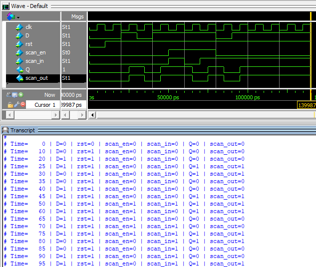

# D Flip-Flop with Scan Chain

This document provides the detailed specification for a D flip-flop (DFF) with scan chain functionality. The module supports normal operation mode as well as scan mode for testing and debugging purposes.

---

## Functional Description
The D flip-flop operates in two modes:

1. **Normal Mode**: The flip-flop captures the value of the `D` input on the rising edge of the clock (`clk`) and stores it in the output `Q`.
2. **Scan Mode**: When the `scan_en` signal is active, the flip-flop captures the value of the `scan_in` input instead of `D`. The captured value is then propagated to the `scan_out` output to support scan chain operations.

Additionally, the flip-flop features an asynchronous active-low reset (`reset`) signal that resets the output `Q` to `0`.

---

## I/O Signals

| Signal       | Direction | Width | Description                                                                 |
|:------------:|:---------:|:-----:|-----------------------------------------------------------------------------|
| `D`          | Input     | 1     | Data input. Used during normal operation mode.                             |
| `clk`        | Input     | 1     | Clock signal. Captures the input on the rising edge.                       |
| `rst`        | Input     | 1     | Asynchronous active-low reset. Resets the output `Q` to `0`.               |
| `scan_en`    | Input     | 1     | Enables scan mode when set to `1`.                                         |
| `scan_in`    | Input     | 1     | Scan input. Used as the data input during scan mode.                       |
| `Q`          | Output    | 1     | Normal mode output. Holds the captured value of `D` or `scan_in`.          |
| `scan_out`   | Output    | 1     | Scan output. Passes the captured value of the flip-flop in the scan chain. |

---

## Functional Behavior

### Reset Behavior
- When `rst` is asserted (`rst = 0`):
  - The flip-flop output `Q` is reset to `0`, regardless of the clock or other inputs.
- When `rst` is deasserted (`rst = 1`):
  - The flip-flop operates normally, capturing data based on the mode.

### Normal Mode
- Condition: `scan_en = 0`
- Behavior:
  - On the rising edge of `clk`, the value of `D` is captured and stored in `Q`.

### Scan Mode
- Condition: `scan_en = 1`
- Behavior:
  - On the rising edge of `clk`, the value of `scan_in` is captured and stored in `Q`.
  - The captured value is also passed to `scan_out` to propagate data through the scan chain.

---

## RTL Design code (in Verilog)
```verilog
module DFF_ScanChain(
	input wire clk,
	input wire D,
	input wire rst,			// Active low reset
	input wire scan_en,		// Enable scan mode
	input wire scan_in, 	// scan input 
	output reg Q,			// normal output
	output wire scan_out	// Scan output
);

	// Scan output is simply the Q value 
	assign scan_out = Q;
	
	always @(posedge clk or negedge rst) begin
		if(!rst) begin	
			Q <= 1'b0;	// Reset the output to 0
		end else if(scan_en) begin
			Q <= scan_in; // Scan mode: capture scan_in 
		end else begin 
			Q <= D; 	// normal mode: capture D 
		end 
	end 
endmodule
```
## Testbench
```verilog
`timescale 1ns/1ps

module tb_DFF_ScanChain;
	reg clk;
	reg D;
	reg rst;
	reg scan_en;
	reg scan_in;
	wire Q;
	wire scan_out;
	
	// Instantiate the DUT 
	DFF_ScanChain uut(.clk(clk),.D(D),.rst(rst),.scan_en(scan_en),.scan_in(scan_in),.Q(Q),.scan_out(scan_out));
	
	// Clock generation
always #5 clk = ~clk;

initial begin
	clk = 0;
	// initialize inputs
	D = 0;
	rst = 0;
	scan_en = 0;
	scan_in = 0;
	
	// Apply reset
	#10 rst = 1; // Release reset after 10 ns
	
	// Test normal operation
	#10 D = 1; // Apply data input
	#10 D = 0; // change data input 
	#10 D = 1;
	
	// Test scan mode
	#10 scan_en = 1; scan_in = 1; // Enable scan mode and input scan data
	#10 scan_in = 0;
	#10 scan_in = 1;
	
	// Test returning to normal mode
	#10 scan_en = 0; D = 0;
	#10 D = 1;
	
	// End simulation
	#50 $stop;
end

	// Monitor signals
initial begin
	$monitor("Time=%5d | D=%b | rst=%b | scan_en=%b | scan_in=%b | Q=%b | scan_out=%b",
			$time, D, clk, rst, scan_en, scan_in, Q, scan_out);
end

endmodule
```
## Simulation with ModelSim


