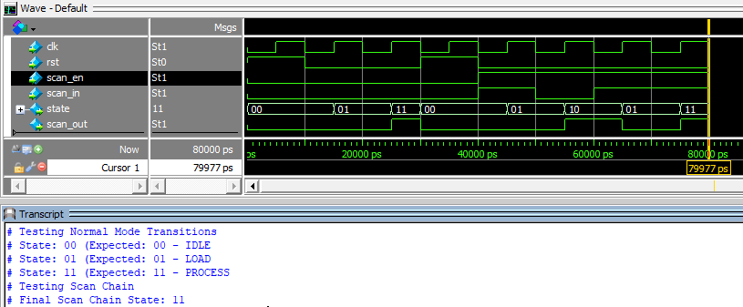

# FSM with Scan Chain

This document outlines the functionality and signal definitions for a finite state machine (FSM) with three states (IDLE, LOAD, PROCESS) and integrated scan chain capability. The scan chain allows for testing and debugging of the FSM's current state by shifting states in and out via a serial interface.

---

## FSM States
1. IDLE (`2'b00`)
   - The default state after reset.
   - Waits for external triggers or conditions to transition.
2. LOAD (`2'b01`)
   - Represents the loading phase where data or resources are prepared.
3. PROCESS (`2'b10`)
   - Indicates the active processing state where main operations occur.

---

## I/O Signals
|Signal|Direction|Width|Description|
|:----:|:-------:|:---:|-----------|
|`clk`|input|1|Synchronizes the FSM transitions and scan chain operations|
|`rst`|input|1|Asynchronous reset signal|
|`scan_en`|input|1|When high, enables scan chain mode, overriding normal FSM operations|
|`scan_in`|input|1|Serial data input used to shift states into the FSM when scan mode is active|
|`scan_out`|output|1|Serial data output representing the current state or shifted-out data|
|`state`|output|1|Reflects the FSM's current state during normal mode|

---

## Functional Behavior
1. **Normal Operation:**
   - The FSM transitions through the states (IDLE -> LOAD -> PROCESS -> IDLE) based on internal logic and clock cycles.
   - State transitions occur synchronously on the rising edge of the clock.

2. **Reset Behavior:**
   - When `rst` is asserted (high), the FSM immediately resets to the IDLE state regardless of the clock.

3. **Scan Chain Mode:**
   - When `scan_en` is asserted (high), the FSM enters scan mode.
   - In scan mode, the FSM shifts states serially through the `scan_in` and `scan_out` signals.
   - The `scan_out` signal reflects the least significant bit of the state register.


---

## RTL Design Code (in Verilog)
```Verilog
module fsm_with_scan(
	input wire clk,
	input wire rst,
	input wire scan_en,
	input wire scan_in,
	output wire scan_out,
	output reg [1:0] state
);

	// State encoding
	localparam IDLE = 2'b00;
	localparam LOAD = 2'b01;
	localparam PROCESS = 2'b10;
	
	reg [1:0] next_state;
	
	// State transition logic (combinational)
always @(*) begin 
	if(!scan_en) begin
		case (state)
			IDLE: next_state = LOAD; // Example transition from IDLE to LOAD 
			LOAD: next_state = PROCESS; // Example transition from LOAD to PROCESS 
			PROCESS: next_state = IDLE; // Example transition from PROCESS to IDLE 
			default: next_state = IDLE; // Default state 
		endcase
	end else begin 
		next_state = state; // Maintain current state in scan mode 
	end
end 
	
	// State update logic (sequential) 
always @(posedge clk or posedge rst) begin 
	if(rst) begin 
		state <= IDLE; // Reset to IDLE state 
	end else if (!scan_en) begin 
		state <= next_state; // Update state in normal mode 
	end else begin 
		// shift state bits in scan mode 
		state <= {state[0], scan_in};
	end
end 

	// Assign scan output (MSB of scan_register) 
	assign scan_out = state[1];
endmodule 
```

## Testbench
```Verilog
`timescale 1ns/1ps
module tb_fsm_with_scan ();
	reg clk;
	reg rst;
	reg scan_en;
	reg scan_in;
	wire scan_out;
	wire [1:0] state;
	
	// Instantiate the DUT
	fsm_with_scan dut(.clk(clk),.rst(rst),.scan_en(scan_en),.scan_in(scan_in),.scan_out(scan_out),.state(state));
	
	// clock generator 
initial clk = 0;
always #5 clk = ~clk;

	// Test procedure 
initial begin 
	rst = 1; 
	scan_en = 0;
	scan_in = 0;
	
	#10 rst = 0; // Release reset after 10 ns
	
	// Test normal mode transitions
	$display("Testing Normal Mode Transitions");
	#10; // IDLE to LOAD 
	$display("State: %b (Expected: 00 - IDLE", state);
	#10; // LOAD to PROCESS
	$display("State: %b (Expected: 01 - LOAD", state);
	#10; // PROCESS to IDLE 
	$display("State: %b (Expected: 10 - PROCESS", state);
	
	// Test scan chian functionality 
	$display("Testing Scan Chain");
	rst = 1;
	#10 rst = 0; 
	scan_en = 1; 
	
	// Shift in a pattern through the scan chain
	scan_in = 1; #10;
	scan_in = 0; #10;
	scan_in = 1; #10;
	scan_in = 1; #10;
	
	$display("Final Scan Chain State: %b", state);

	$stop;
end 
endmodule 
```

## Simulation on ModelSim


