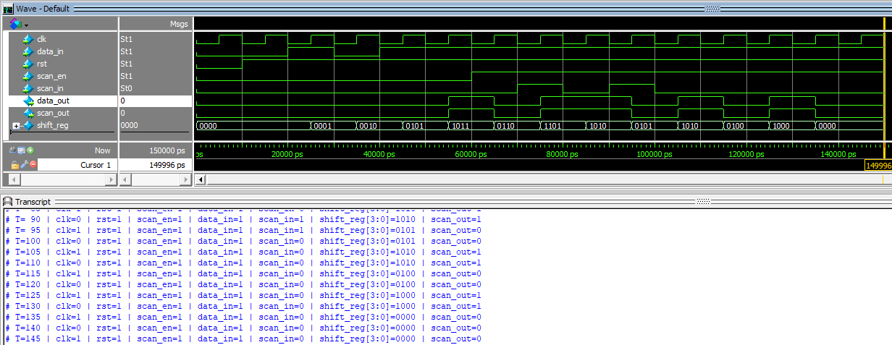

# 4-bit Shift Register with Scan Chain

This document provides the specification for a 4-bit shift register with scan chain functionality. The design supports normal shift register operation and scan mode for testing and debugging purposes.

---

## Functional Description
The shift register operates in two modes:

1. **Normal Mode**: The shift register shifts its content left by one bit on every rising edge of the clock (`clk`). The new data is loaded from `data_in`.
2. **Scan Mode**: When `scan_en` is active, the shift register shifts its content left by one bit, loading new data from the `scan_in` signal. The last bit in the register is passed to the `scan_out` signal to propagate data through the scan chain.

Additionally, the shift register features an asynchronous active-low reset (`rst`) signal that resets all bits to `0`.

---

## I/O Signals

| Signal        | Direction | Width | Description                        |
|:-------------:|:---------:|:-----:|------------------------------------|
| `data_in`     | Input     | 1     | Data input for normal operation.   |
| `clk`         | Input     | 1     | Clock signal. Data is shifted on the rising edge.  |
| `rst`         | Input     | 1     | Asynchronous active-low reset. Resets the shift register to all `0`s. |
| `scan_en`     | Input     | 1     | Enables scan mode when set to `1`.  |
| `scan_in`     | Input     | 1     | Scan input for scan mode operation.  |
| `scan_out`    | Output    | 1     | Scan output. Passes the last bit of the shift register in scan mode. |
| `data_out`    | Output    | 1     | Data output. Passes the last bit of the shift register in normal mode. |

---

## Functional Behavior

### Reset Behavior
- When `reset` is asserted (`rst = 0`):
  - All bits of the shift register are set to `0`, regardless of other signals.
- When `reset` is deasserted (`reset = 1`):
  - The shift register operates normally, shifting data based on the mode.

### Normal Mode
- Condition: `scan_en = 0`
- Behavior:
  - On the rising edge of `clk`, the contents of the shift register shift left by one bit.
  - The new data is loaded into the least significant bit (LSB) from `data_in`.

### Scan Mode
- Condition: `scan_en = 1`
- Behavior:
  - On the rising edge of `clk`, the contents of the shift register shift left by one bit.
  - The new data is loaded into the LSB from `scan_in`.
  - The most significant bit (MSB) is passed to `scan_out` and also `data_out`.

---
## RTL Design Code (in Verilog)
```verilog
module shift_register_scan(
	input wire clk, 		// Clock signal
	input wire data_in,		// Data input for normal operation
	input wire rst, 		// Asynchronous active-low reset
	input wire scan_en,		// Enables scan mode
	input wire scan_in, 	// Scan input 
	output reg data_out, 	// Data ouput for normal operation
	output reg scan_out		// Scan output 
);
	// Internal 4-bit register
	reg [3:0] shift_reg;

	// Scan output is simply the data_out value
	assign scan_out = data_out;
	// Assign the MSB to data_out
	assign data_out = shift_reg[3];

	
always @(posedge clk or negedge rst) begin
	if(!rst) begin 
		// Reset all bits to 0
		shift_reg <= 4'b0;
	end else if(scan_en) begin 
		// Scan mode: shift in scan_in 
		shift_reg <= {shift_reg[2:0], scan_in};
	end else begin 
		// Normal mode: shift in data_in 
		shift_reg <= {shift_reg[2:0], data_in};
	end
end 

endmodule 
```
## Testbench
```verilog
`timescale 1ns/1ps
module tb_shift_register_scan();
	reg clk;
	reg data_in;
	reg rst;
	reg scan_en; 
	reg scan_in;
	wire data_out;
	wire scan_out;
	
	// Instantiate the DUT 
	shift_register_scan dut(.clk(clk),.data_in(data_in),.rst(rst),.scan_en(scan_en),
							.scan_in(scan_in),.data_out(data_out),.scan_out(scan_out));
	
	// Clock generation
always #5 clk = ~clk;
	
	// Test 
initial begin
	// Initialize signals
	clk = 0;
	rst = 0;
	scan_en = 0;
	data_in = 0;
	scan_in = 0;
	
	// Apply reset
	#10 rst = 1; // Release reset after 10 ns
	
	// Normal mode operation
	scan_en = 0; 
	#10 data_in = 1; 
	#10 data_in = 0; 
	#10 data_in = 1;
	#10 data_in = 1;
	
	// Scan mode operation 
	#10 scan_en = 1;
	#10 scan_in = 1;
	#10 scan_in = 0;
	#10 scan_in = 1;
	#10 scan_in = 0;
	
	// Finish simulation 
	#50 $stop;
end 

	// Monitor outputs 
initial begin
	$monitor("T=%3d | clk=%b | rst=%b | scan_en=%b | data_in=%b | scan_in=%b | shift_reg[3:0]=%b | scan_out=%b", $time, 
                 clk, rst, scan_en, data_in, scan_in, dut.shift_reg, scan_out);
end 

endmodule 
```
## Simulation on ModelSim

